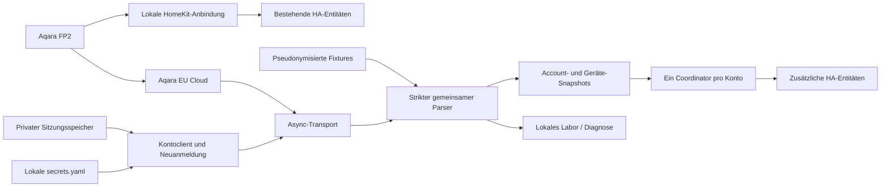

# Architektur

## Grenzen der Schichten

`api/` enthält keine Home-Assistant-Imports. CLI und HA verwenden denselben Parser,
Signer und Transport. Der Transport signiert bereits serialisierte Body-Bytes
und sendet genau diese Bytes. Der feste Host verhindert beliebige Importziele;
TLS bleibt aktiv, Redirects bleiben aus, entpackte Antworten sind auf 2 MiB begrenzt.

Der Parser ordnet Geräte über `deviceId` und Traits über `path` zu. Er unterscheidet
fehlend, null, gültig und ungültig. Metadaten und historisch beobachtete Werte sind
vom aktuellen Ergebnis getrennt. Teilantworten isolieren Gerätefehler.

## Zeit und Qualität

Requeststart, lokaler Empfang, Quellenzeit und lokal beobachteter Wertwechsel
sind unterschiedliche Daten. UTC-Zeitstempel dienen dem Export; monotone Zeit
dient den Empfangs- und Rate-Limit-Fristen. Ein alter Quellenzeitstempel allein
setzt einen gültigen zuletzt gemeldeten Wert nicht auf Null. Zukünftige Quellenzeit
ergibt eine Anomalie. Ein lokaler Watchdog kann Verfügbarkeit ändern, ohne
zusätzliche HTTP-Aufrufe auszulösen.

## Identität und Lebenszyklus

Account-Key, Geräte-ID und stabiler Entitätsschlüssel bilden die Identität.
Token- oder Namensänderungen ändern diese nicht. HomeKit-Geräte werden nicht
zusammengeführt. Laufzeitobjekte liegen in `ConfigEntry.runtime_data`; beim
Entladen werden eigene Listener, Timer und Tasks entfernt. Framework-Sessions
gehören HA und werden vom Client nicht geschlossen.

## Anmeldung und experimenteller Betrieb

Das ausgelieferte Profil bleibt ein Kandidat. Version 0.2.0b1 ergänzt auf
ausdrücklichen Nutzerauftrag einen bewusst aktivierten experimentellen
Anmeldeweg, ohne dadurch Live-Gates als bestanden zu markieren. Login und
serverseitig bestätigte Benutzerkennung erlauben die Kontoprüfung; erst ein
vollständiger Geräteabruf und erfolgreiche lokale Speicherung übernehmen eine
neue Sitzung dauerhaft. Ungeprüfte Tokenimporte sind keine Kontoidentität.

Die Zugangsdatenverwaltung löst Secret-Referenzen lokal auf. Der Kontoclient
koordiniert Login, Geräteprüfung, Sitzungsspeicherung und Wiederanmeldung.
Alle Aufrufe teilen den Kontolimiter; parallele Anforderungen teilen einen
laufenden Anmeldevorgang. Abgelehnte Anmeldungen benötigen Benutzerhilfe;
vorübergehende Transportfehler dürfen nach dem gemeinsamen Backoff erneut
versucht werden. Tokenwechsel ändern weder Geräte- noch Entitätskennungen.

Ein lokaler Signaturvergleich oder eine erfolgreiche Einrichtung beweist keinen
24-Stunden-Betrieb und keine Präsenzsemantik. Die [Live-Gates](ROADMAP.md) bleiben
als separate Nachweise dokumentiert.

## Zusätzliche Ressourcen ab 0.3.0b1

`api/resources.py` führt einen eigenen, begrenzten Ein-Gerät-Vertrag für
`res/query` und `res/query/by/resourceId`. Feldkatalog und Enum-Tabellen stammen
aus fixierten [MIT-lizenzierten Quellen](PROTOCOL_SOURCE.md). Parser und Entitäten
übernehmen keine Nullersatzwerte aus fremden Implementierungen. Fremde Geräte,
mehrdeutige Hüllen, widersprüchliche Duplikate, ungeeignete Typen und übergroße
Antworten werden zurückgewiesen beziehungsweise isoliert.

Der Kontoclient nutzt für Zusatzabfragen ausschließlich eine bereits geprüfte
und gespeicherte Sitzung. Ein Resource-Fehler löst keine eigene Neuanmeldung aus:
Die belegte Ablaufklassifikation gehört zum qlink-Endpunkt. Alle HTTP-Aufrufe
teilen weiterhin denselben Mindestabstand und Server-Backoff.

Der Coordinator startet nach erfolgreichem Trait-Abruf genau einen zusätzlichen
Hintergrundlauf. Ergebnisse liegen getrennt nach `(device_id, query_kind)`;
Listener werden nach jeder Gruppe aktualisiert. Eine neue Antwort ersetzt die
Gruppe vollständig. Lokale monotone Empfangsfristen verhindern die unbegrenzte
Wiederverwendung alter Antworten. Entladen beendet den Hintergrundlauf und
wartende Clientoperationen. Sensor-Eigenschaften führen keine Netzaufrufe aus.

Neue Entitäten entstehen dynamisch nach dem ersten gültigen Feld. Sie verwenden
stabile Ressourcenkennungen und behalten ihre Gerätezuordnung. Schlafentitäten
benötigen einen verfügbaren Moduswert aus derselben Ressourcengruppe. Zusätzliche
Diagnosen exportieren nur Gruppenstatus, Fehlerklasse, Anzahl, Feldname, Typ und
Zeitstempelvorhandensein; keine Rohwerte, Geräte-IDs oder Kontodaten.
