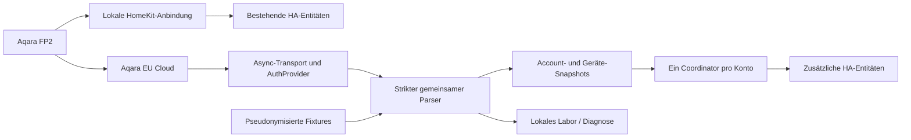

# Architektur

## Grenzen der Schichten

`api/` enthält keine Home-Assistant-Imports. CLI und HA verwenden denselben Parser,
Signer und Transport. Der Transport signiert bereits serialisierte Body-Bytes
und sendet genau diese Bytes. Der feste Host verhindert beliebige Importziele;
TLS bleibt aktiv, Redirects bleiben aus, entpackte Antworten sind auf 2 MiB begrenzt.

Der Parser ordnet Geräte über `deviceId` und Traits über `path` zu. Er unterscheidet
fehlend, null, gültig und ungültig. Metadaten und historisch beobachtete Werte sind
vom aktuellen Ergebnis getrennt. Teilantworten isolieren Gerätefehler.

## Zeit und Qualität

Requeststart, lokaler Empfang, Quellenzeit und lokal beobachteter Wertwechsel
sind unterschiedliche Daten. UTC-Zeitstempel dienen dem Export; monotone Zeit
dient den Empfangs- und Rate-Limit-Fristen. Ein alter Quellenzeitstempel allein
setzt einen gültigen zuletzt gemeldeten Wert nicht auf Null. Zukünftige Quellenzeit
ergibt eine Anomalie. Ein lokaler Watchdog kann Verfügbarkeit ändern, ohne
zusätzliche HTTP-Aufrufe auszulösen.

## Identität und Lebenszyklus

Account-Key, Geräte-ID und stabiler Entitätsschlüssel bilden die Identität.
Token- oder Namensänderungen ändern diese nicht. HomeKit-Geräte werden nicht
zusammengeführt. Laufzeitobjekte liegen in `ConfigEntry.runtime_data`; beim
Entladen werden eigene Listener, Timer und Tasks entfernt. Framework-Sessions
gehören HA und werden vom Client nicht geschlossen.

## Protokollfreigabe

Das ausgelieferte Profil ist ein Kandidat. UI und Transport prüfen die Freigabe
jeweils selbst. Ein manuell gesetztes Konfigurations-Boolean ist kein Nachweis.
Der lokale Signaturvergleich bestätigt ausschließlich die Berechnung zu einem
Capture; eine einzelne Probe bestätigt weder Kontobindung noch Dauerbetrieb.
Automatische Anmeldung, Präsenzmapping und neue Datenkanäle benötigen weitere
unabhängige Nachweise. [Live-Gates](ROADMAP.md) bleiben ausdrücklich offen.

